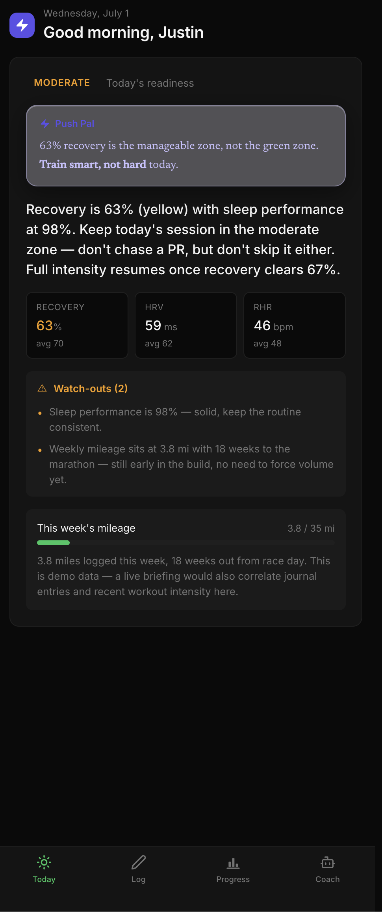
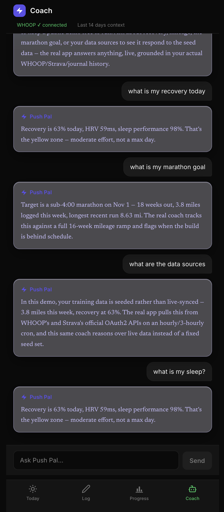
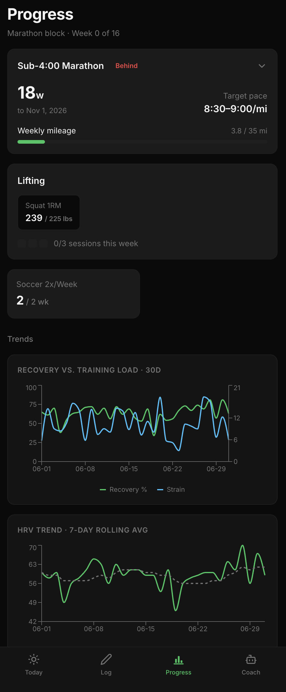
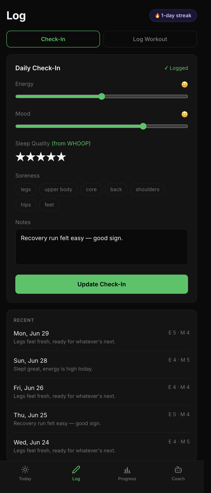

# Push Pal

**A wearable-agnostic AI training coach** — WHOOP recovery data, Strava activity data, and manual `.fit` imports feed one Claude-powered coach that reasons across all of it, instead of living inside any single vendor's app.

🔗 **Live demo:** [add URL here]

---

## The problem

Every wearable ships its own coach — WHOOP Coach, Garmin Coach, Strava's fitness insights — and every one of them only sees the data that platform collects. If you run with a WHOOP strap and a Strava-connected watch and lift with nothing tracking you at all, none of those coaches sees the whole picture, and none of them talks to the others. Push Pal is the opposite bet: pull recovery, activity, and subjective data from whatever sources actually exist (official WHOOP + Strava OAuth2 APIs, or a manually exported `.fit` file when there's no API at all), normalize it into one model, and let an LLM reason over the combined picture — training load *and* recovery *and* how you actually say you feel — instead of optimizing one vendor's metric in isolation.

---

## See it in 60 seconds

| Today — morning briefing | Coach — grounded chat |
|---|---|
|  |  |

| Progress — goal-first trends | Log — check-in + workout logging |
|---|---|
|  |  |

No API keys required — this runs entirely on generated demo data:

```bash
git clone https://github.com/chungjj4-hub/push-pal.git && cd push-pal
npm install && npm install --prefix server && npm install --prefix client
npm run seed:demo          # generates 5 weeks of realistic training data
echo "DEMO_MODE=true" >> .env
npm run dev                 # http://localhost:5173
```

`DEMO_MODE=true` swaps in a seeded SQLite database and replaces live Claude calls with realistic templated responses grounded in that same seeded data (a public demo can't safely make unmetered LLM calls on an unauthenticated endpoint) — everything else, the UI, the goal math, the chart logic, is the real app. Turn `DEMO_MODE` off and connect real WHOOP/Strava/Anthropic credentials to run it against your own data — see [Run it locally](#run-it-locally).

---

## Key product decisions

**Wearable-agnostic by design, not by accident.** WHOOP, Strava, and manually-imported `.fit` files all normalize into one `coros_activities` table with explicit source provenance (`whoop` / `strava` / `fit`) and cross-source deduplication — the same real run auto-uploaded to both WHOOP and Strava collapses into one row instead of double-counting mileage. *Tradeoff:* this is real engineering overhead a single-vendor app doesn't have to do (id-hashing, source-priority merge logic, timezone-correct date derivation per source), in exchange for not being hostage to any one hardware vendor's roadmap, API changes, or willingness to keep a free developer tier open.

**The daily journal is qualitative-only, deliberately.** Energy, mood, soreness, and free-text notes — not another place to log workout structure (that's the separate Log Workout flow). *Tradeoff:* this means logging a workout and checking in are two separate actions, which is more manual entry than an all-in-one form. In exchange, the signal fed to the coach stays clean and easy to reason about longitudinally ("energy's been a 2/5 three days running" is a much sharper prompt input than free-mixing subjective state with structured workout data).

**Progress is goal-first, not a metrics dashboard.** Every trend chart lives inside an expandable goal card (marathon pace, a lift 1RM, weekly session-frequency targets) rather than a flat wall of graphs. *Tradeoff:* it requires defining goals up front — there's a real data model for goals, and an empty-goals state is less immediately useful than a generic "here's all your data" view. In exchange, every number on the page answers "so what" instead of leaving interpretation entirely to the user.

---

## Architecture

```
WHOOP Cloud   ──OAuth2──┐
Strava API    ──OAuth2──┼──▶ Express backend (node-cron: hourly WHOOP, 3-hourly Strava)
COROS Watch   ──.fit────┘         │
                                   ▼
                          SQLite (better-sqlite3)
                                   │
                                   ▼
                    Claude (Sonnet) — coaching briefings + chat
                                   │
                                   ▼
                       React + Vite frontend (mobile-first)
```

- **Frontend** — React + Vite, no CSS framework (all inline styles against a small CSS custom-property token set), React Router, Recharts for trend visualization.
- **Backend** — Express + `better-sqlite3`, `node-cron` for scheduled sync jobs, `multer` + `fit-file-parser` for manual `.fit` upload.
- **Data sources** — WHOOP Developer API (recovery, sleep, HRV, cycles, workouts) and Strava API v3 (GPS activities, pace), both via official OAuth2; manual `.fit` export as a source-agnostic fallback when neither applies.
- **AI layer** — Anthropic's Claude API, given a structured JSON context (recent recovery, activities, journal entries, goals) built fresh on every request — not a fine-tuned model, a carefully-scoped system prompt encoding an actual weekly training framework (hard-day caps, recovery-based load rules, a 16-week marathon progression) that the model reasons against.
- **Sync** — `node-cron` jobs pull WHOOP hourly and Strava every 3 hours (respecting Strava's rate limits), with a 90-day backfill on first connect.

**All WHOOP and Strava integrations use official, documented OAuth2 APIs** (`developer.whoop.com`, Strava API v3) — no unofficial or reverse-engineered endpoints anywhere in this codebase.

---

## Run it locally

### Demo mode (no credentials)
See [See it in 60 seconds](#see-it-in-60-seconds) above.

### Live mode (your own data)

**1. Prerequisites** — Node.js 22 (required — Node 26 has native module compatibility issues with `better-sqlite3`'s prebuilt bindings):
```bash
brew install node@22
export PATH="/opt/homebrew/opt/node@22/bin:$PATH"   # add to ~/.zshrc to persist
```

**2. Environment variables** — copy `.env.example` to `.env` and fill in real values:
```bash
cp .env.example .env
```
- **Anthropic** — API key from [console.anthropic.com](https://console.anthropic.com)
- **WHOOP OAuth2** — register at [developer.whoop.com](https://developer.whoop.com), redirect URI `http://localhost:3001/whoop/callback`
- **Strava OAuth2** — register at [strava.com/settings/api](https://www.strava.com/settings/api), Authorization Callback Domain `localhost`

**3. Install & run:**
```bash
npm install && npm install --prefix server && npm install --prefix client
npm run dev   # backend on :3001, frontend on :5173
```

**4. Connect WHOOP / Strava** — visit `http://localhost:3001/whoop/auth` and `http://localhost:3001/strava/auth` in your browser (WHOOP's redirect flow requires a manual code paste on first connect — the Today page walks through this inline when WHOOP isn't yet connected).

**5. Import COROS/other-watch data manually** — Log tab → Log Workout → any activity without a WHOOP/Strava source can be exported as `.fit` and dragged in directly.

---

## What's not here yet

No automated test suite and no CI pipeline — this was built solo, fast, for personal use first and a portfolio piece second. If this were headed to production: contract tests around the WHOOP/Strava sync normalization logic (that's where the real correctness risk lives — timezone handling, cross-source dedup) would be the first thing added.

---

## Stack

Node.js 22 · Express · SQLite (`better-sqlite3`) · React 19 + Vite · Recharts · Anthropic SDK (Claude) · `node-cron` · `multer` + `fit-file-parser`
